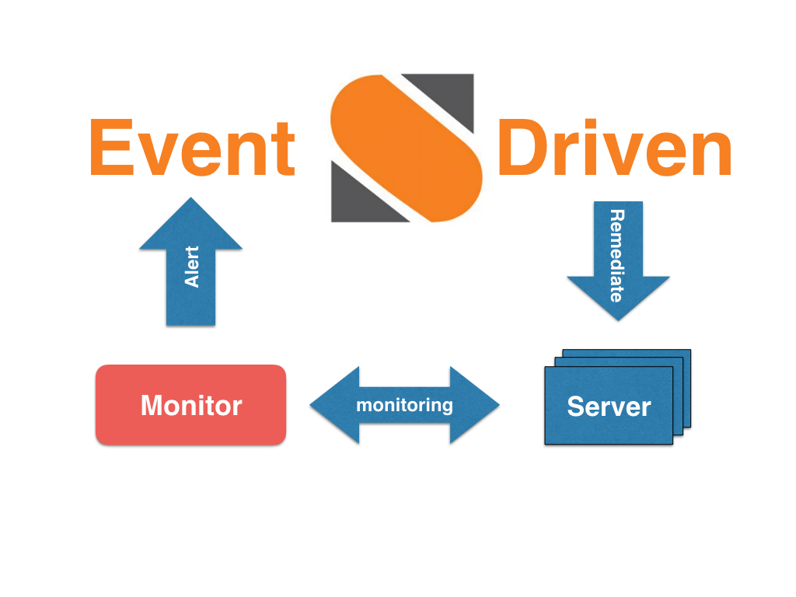

## StackStormによる運用の自動化
[StackStorm で変わる運用](chapter1.md#stackstorm-で変わる運用)で述べられたもの以外にも、DevとOpsのワークフローをStackStormで結びつけることには様々なメリットがあります。

本章ではそのメリットの1つである「ARによる運用稼動の削減」について説明し、
OpenStack環境の運用についてどう適用できるか、ということについて考えていきます。

### ARという概念について
前提として、運用自動化のキーワードとして最近注目されている"AR = *Auto-Remediation*"という概念について説明します。

Auto-Remediation (直訳：自動修復)とは、その名の通り「障害が発生した際に自動で復旧すること」を示しています。

私の知る限り、サービス基盤レベルでARという言葉が使われ始めたのは、2011年にFacebookが発表した[Making Facebook Self-Healing](https://www.facebook.com/notes/facebook-engineering/making-facebook-self-healing/10150275248698920/)が初出です。

上記の記事で

> human engineers could focus on solving and preventing the larger, more complex outages.

と記されているように、ARを運用に取り入れることで「細々としたトラブル対応に時間を取らず、より大きな課題を解決するために時間を使う」ことができるようになります。

具体的にどのようなことをARで行なうか、ということについては、Mirantisの[Auto-remediation: making an Openstack cloud self-healing](https://www.mirantis.com/blog/auto-remediation-making-an-openstack-cloud-self-healing/)という記事が参考になります。

上記の記事では、以下のようなユースケースを挙げています。

> ・Dead process (プロセスの死亡)
> ・Lack of free disk space (ディスク容量の不足)
> ・Overflowed rabbitmq queues (RabbitMQのキュー溢れ)
> ・Corrupted rabbitmq mnesia (RabbitMQのバックエンドDBの故障)
> ・Broken database replication (DBレプリケーションの故障)
> ・Node hardware failures (e.g. triggering VM evacuation) (ノードの物理故障に共なうVMの退避)

また、Netflixでは実際にStackStormによるARを実現しており、[StackStormの公式ブログで紹介されています。](https://stackstorm.com/2015/11/21/netflix-stackstorm-based-auto-remediation-why-how-and-so-what/)

StackStormでも[Auto-Remediation Defined](https://stackstorm.com/2015/08/07/auto-remediation-defined/)で触れられているように、ARを主要なユースケースの1つと位置付けているようです。

さて、次章から上記のようなARを実現するためにStackStormをどう使っていくかについて解説したいと思います。

### StackStormによるARの実現
ここで、StackStormの掲げる"Event-Driven Automation"という思想に則り、ARの動作を整理してみます。

| 登場人物 | 機能 |
| --- | --- |
| Server | 自身の状態をMonitorに通知する |
| Monitor | Serverの状態を受け取り、任意のルールに従ってStackStormに通知する |
| StackStorm | Monitorからの通知をイベントとし、所定の窓口へ通知する&対象のServerをRemidiateする |

このように、非常に綺麗な構成でARの動作を定義することができます。

ZabbixやSensuなどの監視ツールはログの内容によって所定のスクリプトを実行する機能を備えていますが、StackStormという登場人物を増やすことによって
* 監視と処理の責任主体が明確になる
* 処理がActionとWorkflowによって定義されるので、復旧手順の再利用性が高まる
* 有志が公開しているWorkflowなどを流用できる

というメリットがあります。

最後に、次節でOpenStack環境にどうやってARを適用していくかについて解説します。

### OpenStack×StackStormによるARを含めた運用自動化
OpenStackでは、VMや仮想NWなどの資源をDBを用いて管理しています。

しかし、何らかの原因によって仮想資源の実態とDB上の情報が不一致を起こすことは珍しくありません。

情報の不一致が起こったとき、どのようにDBを修正するかor仮想資源を再配置するかという判断には知識と経験が要求されます。

また、何らかのエラーが発生した場合のトラブルシューティングにおいて、エラーに対応したDBテーブルや関連ログの収集にはやはり高いレベルの知識と経験が必要であり、運用チームの高負荷に繋がっています。

上記のような問題を解決するための方法の1つとして、StackStormを用いたARが有効です。

具体的には、

* DBと実態の不一致 → 関連情報を収集し、DBと実態の対応関係を自動修復
* その他AR手順が登録済である問題 → ARによる自動修復
* ARに登録されていない問題 → エラー発生時刻近辺の関係するログを自動収集し、関係性を自動で図示

などの動作をStackStorm上に定義することにより、定型的な問題については自動修復し、複雑な問題についても担当者の調査&原因特定にかかる稼動を大幅に削減することができると考えています。

また、問題の大きさや関係するログの範囲などの指標によって対処にかかる人的稼動量を自動で見積もる、ということもできるようになるかもしれません。

最後になりますが、OpenStackを始めとする大規模システムの運用に関する意見や質問などは常にお待ちしています。お気軽にお問い合わせ下さい。

